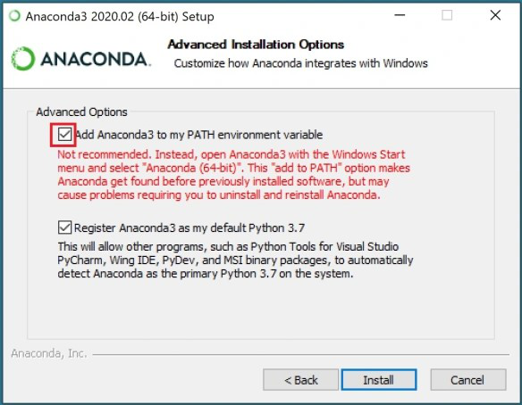

# pands-weekly-tasks

This repository is dedicated to showcasing my progress and skills in programming and scripting by writing simple programs using Python.

## Description

In this repository, you will find scripts that demonstrate my abilities in Python programming. Each program is designed to highlight different aspects of programming and scripting, covering a wide range of topics and techniques. 

## Contents

The repository includes weekly task programs:

- `week1`: Write program [helloworld.py](https://github.com/TomUszyn/pands-weekly-tasks/blob/main/helloworld.py), that displays Hello World! when it is run.
- `week2`: Write a program called [bank.py](https://github.com/TomUszyn/pands-weekly-tasks/blob/main/bank.py). 
The program should:
    *  Prompt the user and read in two money amounts (in cent)
    *  Add the two amounts
    *  Print out the answer in a human readable format with a euro sign and decimal point between the euro and cent of the amount. 
- `week3`: Write a python program called [accounts.py](https://github.com/TomUszyn/pands-weekly-tasks/blob/main/accounts.py), that reads in a 10 character account number and outputs the account number with only the last 4 digits showing (and the first 6 digits replaced with Xs).
- `week4`: Write a program, called [collatz.py](https://github.com/TomUszyn/pands-weekly-tasks/blob/main/collatz.py), that asks the user to input any positive integer and outputs the successive values of the following calculation. At each step calculate the next value by taking the current value and, if it is even, divide it by two, but if it is odd, multiply it by three and add one.
Have the program end if the current value is one.
- `week5`: Write a program that outputs whether or not today is a weekday. The program is called [weekday.py](https://github.com/TomUszyn/pands-weekly-tasks/blob/main/weekday.py).
You will need to search the web to find how you work out what day it is.
- `week6`: Write a program called [squareroot.py](https://github.com/TomUszyn/pands-weekly-tasks/blob/main/squareroot.py) that takes a positive floating-point number as input and outputs an approximation of its square root. You should create a function called sqrt that does this.
- `week7`: Write a program [es.py](https://github.com/TomUszyn/pands-weekly-tasks/blob/main/es.py) that reads in a text file and outputs the number of e's it contains. The program takes the filename from an argument on the command line.
- `week8`: Write a program called [plottask.py](https://github.com/TomUszyn/pands-weekly-tasks/blob/main/plottask.py) that displays:
   * a histogram of a normal distribution of a 1000 values with a mean of 5 and standard deviation of 2, 
   * a plot of the function  $h(x) = x^3$ in the range 0 to 10,

     on the one set of axes.

To read more about each file go to the [Documentation Jupyter Notebook](Documentation.ipynb).

Feel free to explore each program to learn more about the programs and scripts I have worked on. I tried to make code easier to understand by making a lot of comments. Each program includes referal links to webpages which help to understand the code.

## Getting Started

If you want to be sure that you have the right programming environment for this repository, you should follow these extra 
steps:

1. Install Anaconda: 
    - Download the Anaconda distribution for your operating system from the official Anaconda website: https://www.anaconda.com/products/individual
    - Follow the installation instructions provided on the website. 
      During instalation MAKE SURE you check the two check boxes
       * Add to PATH variable
       * Make this version your default Python



   

2. Install Git:
    - Download Git for your operating system from the official Git website: https://git-scm.com/downloads
    - Follow the installation instructions provided on the website.

3. Install Visual Studio Code (VS Code):
    - Download Visual Studio Code for your operating system from the official VS Code website: https://code.visualstudio.com/download
    - Follow the installation instructions provided on the website.

4. Configure Git:
    - Open a terminal or Git Bash.
    - Set your name and email address using the following commands:
      ```
      git config --global user.name "Your Name"
      git config --global user.email "your.email@example.com"
      ```

5. Clone the repository to your local machine using the following command:
    ```
    git clone https://github.com/TomUszyn/pands-weekly-tasks.git
    ```

6. Navigate to the cloned repository:
    ```
    cd pands-weekly-tasks

7. In VS Code, pick one of the available programs with extension .py from the pands-weekly-tasks folder, run the program
by typing the file name, and press enter to execute it. There is only one exception in the case of the es.py file, where the user must input the name of the .txt file as an argument.

Notice: Make sure you are in the correct patch for the file you are trying to execute. Otherwise, you may encounter an error.

## License

This repository is licensed under the MIT License. See below:


Copyright (c) 2024 <copyright holder Tomasz Uszynski>

Permission is hereby granted, free of charge, to any person obtaining a copy
of this software and associated documentation files (the "Software"), to deal
in the Software without restriction, including without limitation the rights
to use, copy, modify, merge, publish, distribute, sublicense, and/or sell
copies of the Software, and to permit persons to whom the Software is
furnished to do so, subject to the following conditions:

The above copyright notice and this permission notice shall be included in all
copies or substantial portions of the Software.

THE SOFTWARE IS PROVIDED "AS IS", WITHOUT WARRANTY OF ANY KIND, EXPRESS OR
IMPLIED, INCLUDING BUT NOT LIMITED TO THE WARRANTIES OF MERCHANTABILITY,
FITNESS FOR A PARTICULAR PURPOSE AND NONINFRINGEMENT. IN NO EVENT SHALL THE
AUTHORS OR COPYRIGHT HOLDERS BE LIABLE FOR ANY CLAIM, DAMAGES OR OTHER
LIABILITY, WHETHER IN AN ACTION OF CONTRACT, TORT OR OTHERWISE, ARISING FROM,
OUT OF OR IN CONNECTION WITH THE SOFTWARE OR THE USE OR OTHER DEALINGS IN THE
SOFTWARE.

## Contact

If you have any questions or suggestions, feel free to reach out to me at [tomaszuszynski3@gmail.com](mailto:tomaszuszynski@gmail.com).

## Author

As a novice in the world of programming, I am deeply passionate about this field and eager to explore new concepts and technologies. Programming provides me with a platform to showcase my creativity and problem-solving abilities, fueling my enthusiasm to improve my programming skills. With programming, I can delve into data analysis, work with datasets, identify important findings, and make data-driven decisions. It equips me with the necessary tools and skills to explore intricate data sets, apply statistical techniques, and visualize data effectively. Programming offers a plethora of opportunities in data analysis, enabling me to contribute to solving real-world issues. Programming drives me to work diligently in my everyday routine and helps me translate ideas into real-life applications. It is a stimulating and rewarding field with countless possibilities for personal and professional growth.

Best regards,

Tomasz Uszynski